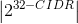

    XXXXX     XXX                            XXXXXXXXX
    XXXXXX    XXX                            XXX    XXX
    XXX XXX   XXX	XXXXXX   XXXX     XXXX   XXX     XXX   XXX         XXXXXX
    XXX  XXX  XXX	XXX      XXXXX   XXXXX   XXX    XXX  XXX XXX     XX
    XXX   XXX XXX	XXXXX	 XXX XXXXX XXX   XXXXXXXX   XXX   XXX   X
    XXX    XXXXXX	XXX	 XXX	   XXX   XXX        XXXXXXXXX    XX
    XXX     XXXXX   XXXXXX   XXX       XXX   XXX        XXX   XXX      XXXXXX

# Network Mapping and Packet Capture and Analysis
--------------------------------------------------------------------------

		Table of Content
	--------------------------------
	0.......INTRO
	1.......MODULES
	 1.0....NETWORK MAPPER
	 1.1....PACKET CAPTURE AND ANALYSIS
	 1.2....AI COMPARISON

	

